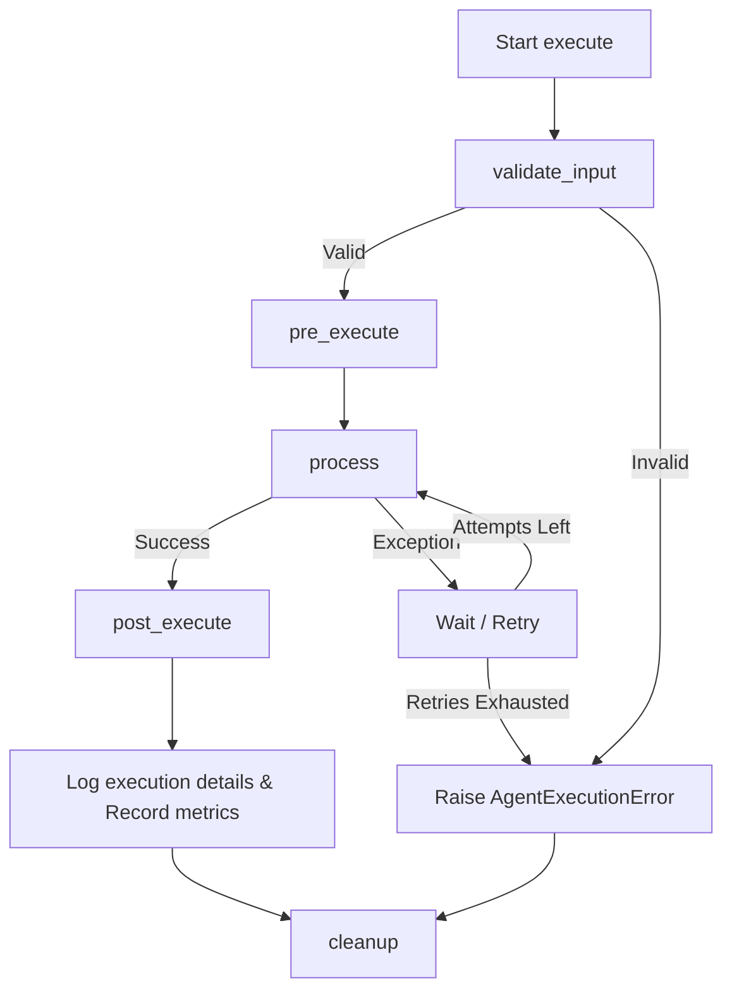

# UK AML & KYC compliance Agentic AI Framework

This package defines the automated compliance audit and decision framework. Every agent follows a strict abstract interface, reads/updates a shared memory context (`AgentState`), collects standard Prometheus-ready metrics, and logs execution details in structured JSON formats.

---

## Folder Structure

```
backend/app/agents/
├── README.md               # Framework documentation
├── base/                   # Core definitions and base framework
│   ├── base_agent.py       # Abstract Base Agent class
│   ├── agent_state.py      # Shared memory State class (LangGraph compatible)
│   ├── agent_result.py     # Pydantic validation response container
│   ├── agent_context.py    # DI infrastructure container (DB, Redis, LLM clients)
│   ├── exceptions.py       # Custom exception framework
│   ├── registry.py         # Thread-safe Singleton Agent Registry
│   ├── logger.py           # Structured JSON log formatter
│   └── metrics.py          # Prometheus telemetry counter
├── orchestrator/           # Coordination of execution graphs
├── kyc/                    # Profile parameters and source of wealth checks
├── document/               # Image quality, OCR match, and fraud checks
├── company/                # UBO structures and company registry audits
├── pep/                    # Politically exposed persons screener
├── sanctions/              # OFAC/UN/UK lists screener
├── country/                # Geographic residency/nationality risk calculations
├── transaction/            # Ledger velocity and structure checks
├── account/                # dormancy and linked account audits
├── regulation/             # Regulatory rules engine
├── risk/                   # Aggregate risk score calculations
├── investigation/          # LLM summary narrative generators
├── decision/               # Approve/Reject logic engine
└── monitoring/             # Periodic review re-onboarding timers
```

---

## Agent Lifecycle

Every agent execution undergoes a standardized lifecycle controlled by `BaseAgent.execute()`:



1. **`validate_input(state)`**: Validates if the state has the fields required for the checks (e.g. asserts Customer exists).
2. **`pre_execute(state)`**: Logs start parameters and marks `current_agent`.
3. **`process(state)`**: Executes actual intelligence analysis.
4. **`post_execute(state, result)`**: Appends running log trails, updates `completed_agents` lists, and saves to state memory.
5. **`cleanup(state)`**: Standard finalizer run whether execution completed or failed.

---

## How to Create a New Agent

### Example: Writing the `KycAgent`

Create the subclass file inside `backend/app/agents/kyc/kyc_agent.py`:

```python
from typing import Dict, Any, List
from app.agents.base.base_agent import BaseAgent
from app.agents.base.agent_state import AgentState
from app.agents.base.registry import AgentRegistry

@AgentRegistry.register("kyc_agent")
class KycAgent(BaseAgent):
    def get_name(self) -> str:
        return "kyc_agent"

    def get_version(self) -> str:
        return "1.0.0"

    def get_description(self) -> str:
        return "Audits individual KYC profile parameter completeness and PEP alignments."

    def get_capabilities(self) -> List[str]:
        return ["completeness_check", "nationality_match", "occupation_risk_audit"]

    def validate_input(self, state: AgentState) -> bool:
        # Require customer and KYC profile loaded in state memory
        return bool(state.customer) and state.kyc_profile is not None

    async def process(self, state: AgentState) -> Dict[str, Any]:
        kyc = state.kyc_profile
        findings = []
        warnings = []
        risk_score = 0.0
        
        # Audit checks
        if not kyc.get("source_of_funds"):
            warnings.append("Missing source of funds declaration.")
            risk_score += 20.0
        else:
            findings.append("Source of funds declared.")

        if kyc.get("occupation") in ["Diplomat", "Politician"]:
            warnings.append("High risk occupation detected.")
            risk_score += 50.0

        risk_level = "high" if risk_score >= 50.0 else "medium" if risk_score >= 20.0 else "low"

        return {
            "risk_score": risk_score,
            "risk_level": risk_level,
            "findings": findings,
            "warnings": warnings,
            "confidence": 1.0,
            "_status": "success",
            "_reason": "KYC Profile validation audit complete."
        }
```

---

## Coding Standards

1. **Structured Outputs**: Never return raw dictionaries from `BaseAgent.execute()`. Always return `AgentResult`.
2. **Immutable-Friendly Updates**: When updating metadata state, use `state.update_metadata(key, value)` to avoid unintended shared dictionary side-effects.
3. **Database & Client Access**: Do NOT instantiate raw DB or Redis sessions inside the agent. Use `self.db` or `self.context.redis_client` initialized by the `AgentContext` Dependency Injection.

---

## Future LangGraph Integration

The `AgentState` inherits from Pydantic `BaseModel`, which makes it fully compatible with LangGraph's `StateGraph`.

### Sample Configuration:
```python
from langgraph.graph import StateGraph
from app.agents.base.agent_state import AgentState
from app.agents.base.registry import AgentRegistry

# Define node executor wrappers
async def kyc_node(state: AgentState) -> AgentState:
    agent = AgentRegistry.get_registry().get_agent("kyc_agent")
    await agent.execute(state)
    return state

# Setup LangGraph Pipeline
workflow = StateGraph(AgentState)
workflow.add_node("kyc", kyc_node)
workflow.set_entry_point("kyc")
app = workflow.compile()
```
