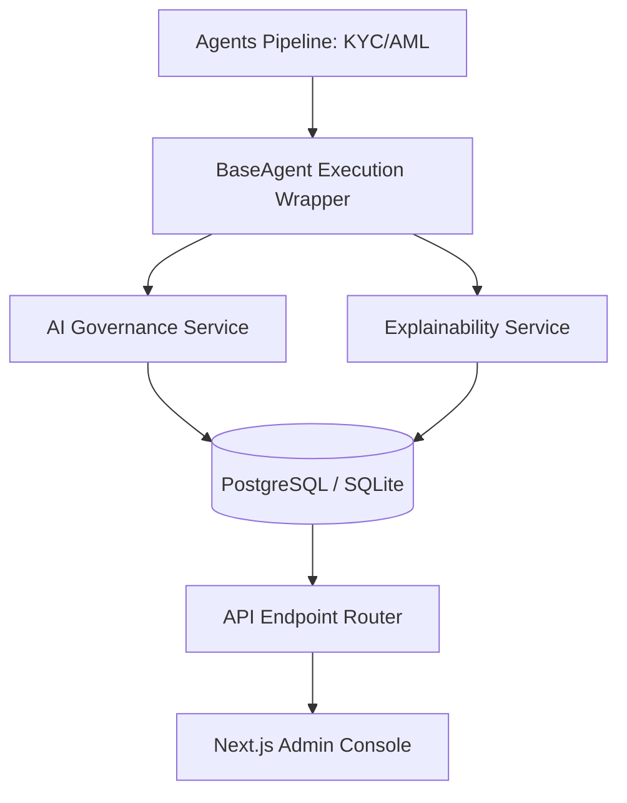

# AI Governance & Explainability Framework Documentation

This document covers the architectural components, prompt/model lifecycles, cost equations, and deployment notes for the Phase 17 Enterprise AI Governance and Explainability System.

---

## 1. System Architecture

The AI Governance module intercepts all LLM requests triggered across the compliance agent graph. It registers details about token inputs, outputs, estimated usage pricing costs, response latencies, and compiles structured decision trees mapping rules evaluations to matched signals:



---

## 2. Model & Prompt Lifecycles

### Model Lifecycle
1. **Registered**: Model identifier and provider mapping created inside registry database.
2. **Versioned**: Snapshot checkpoints (e.g. `v1.0.0`) are linked to hyperparameter options.
3. **Active**: Route screening agents execution to this active version.

### Prompt Lifecycle
```
Draft -> Pending Review -> Approved -> Published (Active) -> Deprecated -> Archived
```
- Prompts are soft-deleted only; legacy prompt text is retained for auditing historical transactions.
- Switching/rolling back version requires approved status.

---

## 3. Explainability decision Reports

Every agent action registers an explainability summary mapping:
- **Executive Summary**: Simplified decision summary.
- **Reasoning Tree**: Evaluated rules matching outcomes.
- **Supporting Evidence**: Details of flagged transaction signals.
- **Alternative Outcomes**: Explanations if metadata conditions varied.

---

## 4. Cost Estimation Formula

Costs are computed dynamically during agent execution intercept hooks:

$$\text{Total Cost} = \left(\frac{\text{Input Tokens}}{1000} \times \text{Input Rate}\right) + \left(\frac{\text{Output Tokens}}{1000} \times \text{Output Rate}\right)$$

### Pricing Matrix (Default config)
- **Gemini**: Input: $\$0.000075$ / 1k tokens, Output: $\$0.000300$ / 1k tokens.
- **OpenAI**: Input: $\$0.002500$ / 1k tokens, Output: $\$0.010000$ / 1k tokens.
- **Claude**: Input: $\$0.003000$ / 1k tokens, Output: $\$0.015000$ / 1k tokens.

---

## 5. Security & RBAC Policies

Access control rules:
- **Customers**: Blocked from all `/api/v1/ai/` routes (returns HTTP 403 Forbidden).
- **Admins & AI Admins**: Full CRUD over models, versions, policies and prompts templates.
- **Compliance Officers**: Write feedback rating logs and review execution details.
- **Auditors**: Read-only access to dashboards, analytics, and explanation summaries.
